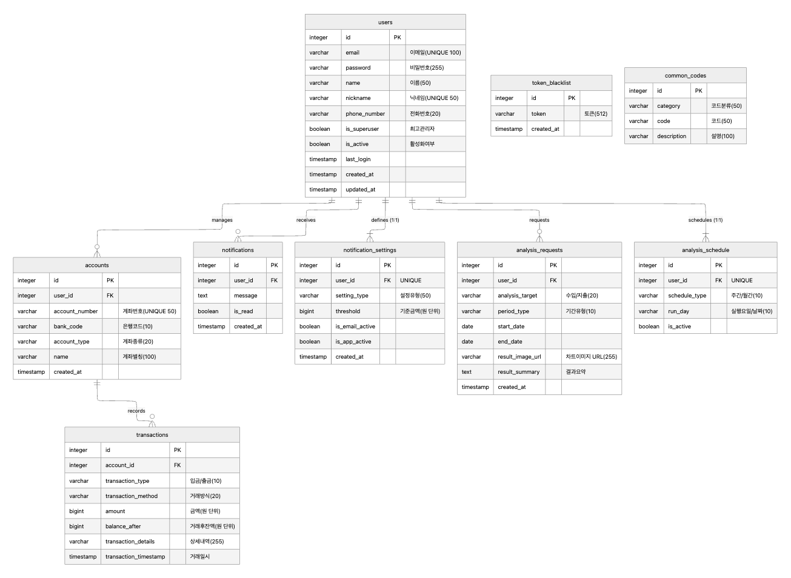

제공해주신 팀원별 역할을 반영하여 `Poetry` 기반의 README를 최종 Markdown 형식으로 수정해 드립니다. 이 내용을 그대로 복사(복붙)하여 사용하시면 됩니다.

-----

# 🏡 미니 프로젝트: 나만의 가계부 시스템 구현 (Account Book System)

## 📌 프로젝트 소개

본 프로젝트는 다양한 웹 프레임워크(선택 사항)를 활용하여 **종합적인 가계부 관리 시스템**을 구현하는 것을 목표로 합니다. 단순한 CRUD 기능을 넘어, 데이터 시각화, 스케줄링, 알림 등 도전적인 기능들을 통해 팀 역량을 최대한 발휘하고 협업 경험을 쌓을 수 있도록 설계되었습니다.



## 💻 완성할 프로젝트의 핵심

프로젝트의 핵심은 **사용자 친화적인 가계부 시스템**을 구축하는 것입니다. 사용자는 자신의 계좌와 입출금 거래 내역을 체계적으로 관리하고, 소비 패턴을 분석할 수 있습니다.

### ✨ 주요 기능 (Features)

| 카테고리 | 상세 기능 | 담당 팀원 |
| :--- | :--- | :--- |
| **인증/계정** | 회원가입, 로그인/로그아웃 | **양민석** |
| **관리자/모델** | **Django Admin Page** 활용, 모델 관리 | **최재흥** |
| **자산 관리** | 계좌 등록 / 삭제 / 조회 (**CRD**) | **이아진** |
| **거래 내역** | 거래 내역 기록 / 조회 / 삭제 / 수정 (**CRUD**) | **이시영** |
| **조회/분석** | 거래 내역 **필터링** (기간별, 항목별 등) | **이시영** |
| **[도전 과제 1]** | 소비 금액 비교, 분석 및 **데이터 시각화** + **스케줄링** 구현 | **이아진** |
| **[도전 과제 2]** | 사용자에게 필요한 정보 전달을 위한 **알림 기능** 구현 | **최재흥** |

-----

## 🏃 프로젝트 목표 및 학습 경험

이 프로젝트를 통해 팀원들이 얻게 될 주요 학습 목표와 경험은 다음과 같습니다.

  * **협업 능력 강화:** Git/GitHub를 활용한 체계적인 **협업 경험** 쌓기
  * **개발 환경 구축:** **`Poetry`** 를 활용한 효율적인 **의존성 관리** 및 가상 환경 구성
  * **컨테이너 이해:** **Docker 컨테이너**를 활용한 개발 환경 구축 및 이해
  * **데이터베이스:** **PostgreSQL 데이터베이스 연동**, **ORM** 사용법 숙지, **ERD** 정립 및 **Test 코드(TDD)** 작성
  * **프레임워크 활용:** 선택한 **웹 프레임워크**의 깊이 있는 활용 방법 학습
  * **DevOps 경험:** **CI/CD 스크립트 제작 경험** (With. Github Actions)
  * **실제 배포:** **AWS EC2**를 이용한 서비스 배포 경험

-----

## 🛠️ 단계별 진행 과정 (Milestones)

프로젝트는 총 6단계의 마일스톤으로 나누어 진행됩니다. 도전 과제는 팀의 역량과 관심사에 따라 자유롭게 선택할 수 있습니다.

### 1단계: 개발 환경 및 초기 설정

  * 개발 환경 및 **협업 환경** 준비.
  * 프로젝트의 초기 구조 및 코드 컨벤션 등 **규칙 설정**.
  * **Poetry**와 **Docker**를 이용하여 개발환경을 컨테이너화 시켜봅니다.

### 2단계: 데이터베이스 설계 및 모델 생성

  * **ERD** (개체-관계 다이어그램) 설계 및 정립.
  * 설계된 ERD를 기반으로 **모델(Model) 생성**.
  * **(도전 과제):** `wait_for_db` 스크립트를 통한 데이터베이스 초기화 대기 기능 구현.

### 3단계: 핵심 API 개발 및 최적화

  * **API 스펙** 문서 작성 (OpenAPI/Swagger 등 고려).
  * **회원/인증**, **계좌**, **거래 내역** 관련 핵심 API 개발.
  * **ORM 쿼리 최적화** 진행.
  * **(도전 과제):** **소셜 로그인** 기능 구현.
  * **(도전 과제):** **API 문서화** 도구 연동.

### 4단계: 데이터 시각화 및 주기적 분석

  * 사용자의 주간/월간 소비 데이터를 수집 및 분석.
  * 분석 결과를 **데이터 시각화**하여 제공.
  * 주기적인 백그라운드 분석 작업을 **Celery** 등을 활용하여 **스케줄링** 처리.

### 5단계: 알림 기능 구현

  * 특정 이벤트(예: 예산 초과 임박, 주기적 보고서) 발생 시 **알림 기능** 구현.

### 6단계: 서비스 배포

  * **Github Actions**를 이용한 **CI/CD 스크립트** 제작.
  * 개발된 서비스를 **AWS EC2**를 활용하여 최종 배포.

-----

## 👥 팀원 구성 및 기여 방법

팀원별 역할 분담은 다음과 같습니다.

| 이름 | 주요 역할 및 담당 기능 | GitHub Profile |
| :--- | :--- | :--- |
| **양민석** | 회원가입, 로그인/로그아웃 (인증/계정) | `[링크]` |
| **최재흥** | Django Admin Page, 모델 관리, **(도전)** 알림 기능 | `[링크]` |
| **이시영** | 거래 내역 CRUD, 거래 내역 필터링 | `[링크]` |
| **이아진** | 계좌 CRD, **(도전)** 데이터 시각화 + 스케줄링 | `[링크]` |

> **기여 방법:** 버그 수정이나 기능 추가를 원할 경우, 저장소를 **Fork**하여 작업 브랜치에서 변경 사항을 커밋한 후 **Pull Request (PR)** 를 생성해 주세요.

-----

## ⚙️ 실행 방법

*(이 부분은 팀이 프레임워크와 환경 설정을 완료한 후 구체적인 명령어를 추가해야 합니다.)*

1.  **저장소 클론:**
    ```bash
    git clone [저장소 URL]
    ```
2.  **Docker 환경 실행:**
    ```bash
    docker-compose up -d --build
    ```
3.  **...**

-----# miniproject
